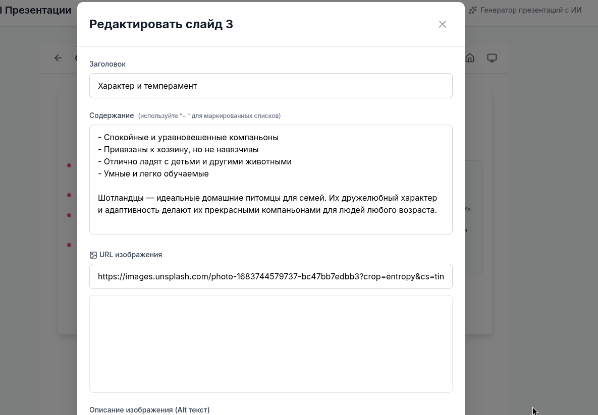
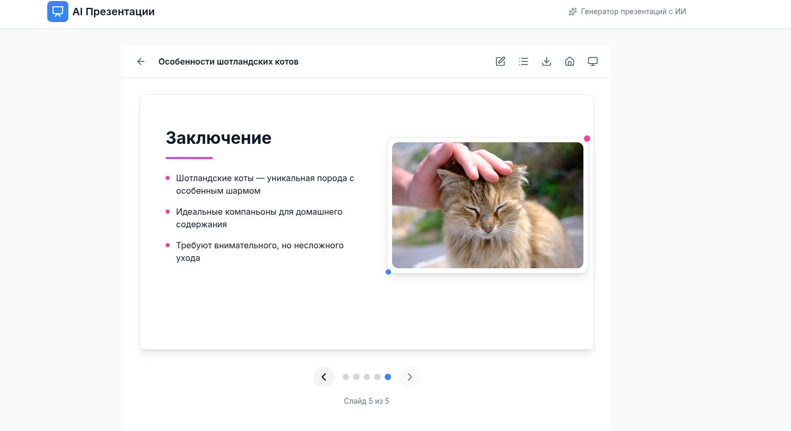

# AI Presentation Builder - Frontend

**AI-powered presentation builder with beautiful, customizable themes and intuitive editing**

A modern React application that enables users to create professional presentations using AI. Features a minimalistic design with multiple theme options, drag-and-drop slide reordering, and real-time editing capabilities.

---

## 📸 Скриншоты

### Создание презентации


### Редактор презентации


### Предварительный просмотр слайдов


---

## ✨ Основные функции

- **🤖 Генерация презентаций с помощью ИИ** - автоматическое создание структурированного контента по теме
- **🎨 Множество тем оформления** - выбор из минималистичной, профессиональной, градиентной, темной и креативной тем
- **🖼️ Автоматический подбор изображений** - интеграция с Unsplash API для релевантных иллюстраций
- **📐 Разнообразные макеты слайдов** - image_left, image_right, image_top, split_content, grid_layout, text_only
- **✏️ Редактирование слайдов** - изменение заголовков, контента и изображений в реальном времени
- **🔄 Drag & Drop переупорядочивание** - интуитивная перестановка слайдов перетаскиванием
- **💾 Экспорт в PPTX** - скачивание готовых презентаций в формате PowerPoint
- **📱 Адаптивный дизайн** - корректное отображение на всех устройствах
- **🎯 Фильтрация контента** - умное отображение контента в зависимости от макета слайда

---

## 🛠️ Технологический стек

### Основные технологии
- **React 19** - современная библиотека для создания пользовательских интерфейсов
- **Vite** - быстрый инструмент сборки и разработки
- **React Router v7** - маршрутизация на стороне клиента
- **Axios** - HTTP-клиент для взаимодействия с API

### UI и стилизация
- **Tailwind CSS** - утилитарный CSS-фреймворк
- **Lucide React** - набор иконок
- **PostCSS & Autoprefixer** - обработка CSS

### Drag & Drop
- **@dnd-kit/core** - базовая функциональность drag & drop
- **@dnd-kit/sortable** - сортируемые списки
- **@dnd-kit/utilities** - вспомогательные утилиты

### Инструменты разработки
- **ESLint** - линтер для JavaScript
- **TypeScript types** - типизация для React

---

## 🚀 Установка и запуск

### Предварительные требования

- Node.js >= 18.0.0
- npm или yarn

### Установка

1. **Клонируйте репозиторий:**
   ```bash
   git clone https://github.com/krantro2938/preza-frontend.git
   cd ai-presentation-builder/frontend
   ```

2. **Установите зависимости:**
   ```bash
   npm install
   ```

3. **Настройте переменные окружения:**
   
   Создайте файл `.env` в корне директории frontend:
   ```env
   VITE_API_BASE_URL=http://localhost:8000
   ```

### Запуск в режиме разработки

```bash
npm run dev
```

Приложение будет доступно по адресу: `http://localhost:5173`

### Сборка для production

```bash
npm run build
```

Скомпилированные файлы будут находиться в директории `dist/`

### Preview production сборки

```bash
npm run preview
```

### Линтинг кода

```bash
npm run lint
```

---

## 📁 Структура проекта

```
frontend/
├── src/
│   ├── components/        # React компоненты
│   │   ├── layouts/      # Компоненты макетов слайдов
│   │   └── ui/           # UI компоненты
│   ├── pages/            # Страницы приложения
│   ├── services/         # API сервисы
│   ├── utils/            # Утилиты и хелперы
│   ├── config/           # Конфигурация тем
│   ├── App.jsx           # Главный компонент
│   └── main.jsx          # Точка входа
├── public/               # Статические файлы
└── package.json          # Зависимости проекта
```

---

## 🎨 Доступные темы

1. **Minimalist** - чистый и простой дизайн с синими акцентами
2. **Professional** - бизнес-стиль с зелеными акцентами  
3. **Gradient** - современный дизайн с фиолетово-розовыми градиентами
4. **Dark** - темная тема с серо-синей палитрой
5. **Creative** - яркая креативная тема с оранжевыми акцентами

---

## 🔗 API Endpoints

Frontend взаимодействует со следующими endpoints:

- `POST /api/presentations` - создание новой презентации
- `GET /api/presentations` - получение списка всех презентаций
- `GET /api/presentations/:id` - получение конкретной презентации
- `PATCH /api/slides/:id` - обновление слайда
- `PATCH /api/presentations/:id/reorder` - изменение порядка слайдов
- `DELETE /api/presentations/:id` - удаление презентации
- `GET /api/presentations/:id/download/pptx` - скачивание PPTX
- `GET /api/proxy/image` - прокси для изображений

---

## 📝 Лицензия

MIT

---

## 👥 Разработка

При разработке следуйте установленным правилам ESLint и используйте компоненты из существующей структуры для поддержания единообразия кода.